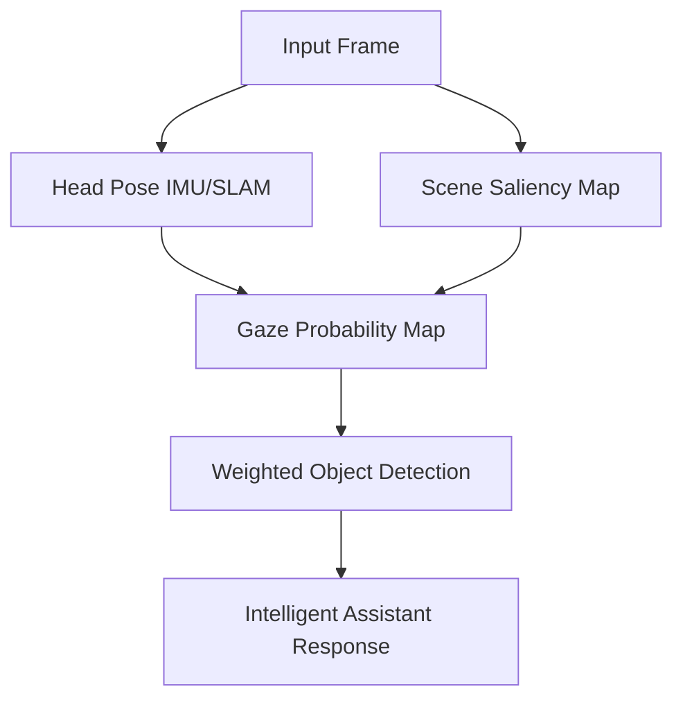

# Research Vision: Egocentric Edge AI for Wearables (Meta Glasses)

> **Date**: 2024-12-22  
> **Topic**: Future directions for intelligent egocentric assistants using Meta Glasses and SLAM/YOLO pipelines.

---

## 🔬 Core Philosophy
Wearable edge AI should not just "see" frames—it should **understand user intent**. Because the glasses share the user's field of view, we can treat the camera signal as a proxy for the user's attention. The goal is to move from **Passive Detection** to **Active Cognitive Assistance**.

---

## 🚀 Research Pillars

### 1. Gaze-Conditioned Scene Understanding (Visual Attention)
Most AI models process the entire frame with equal weight. In egocentric vision, we should prioritize what the user is fixating on.

**The Proposal**: Use head pose (from SLAM/IMU) and scene saliency to create a "Gaze Heatmap."
- **Mechanism**: Weight YOLO/RF-DETR confidence scores by spatial proximity to the inferred gaze center.
- **Benefit**: Reduces false positives in the periphery and concentrates compute/attention on relevant objects.

---

### 2. Temporal Object Memory (The "Memory Palace")
Existing SLAM systems anchor points; we want to anchor **semantics**. 

**The Proposal**: A persistent spatial database that maps object IDs to 3D world coordinates.
- **Object Permanence**: If a "Coffee Cup" is detected and anchored at `(x, y, z)`, it remains in the "Memory Palace" even when the camera turns away.
- **Change Detection**: When the user returns to a room and an object is missing or moved, the system flags a "State Change."
- **Utility**: "Where did I leave my keys?" → System retrieves the last known 3D anchor for `key_object`.

---

### 3. Zero-Shot Re-ID via VLM Embeddings
Instead of hard-coded classes, we want to talk to our environment.

**The Proposal**: Using Vision-Language Models (VLM) like CLIP or SigLIP to generate embeddings for every detected object.
- **Semantic Querying**: The user asks "Where is the blue tool?" 
- **Mechanism**: The text "blue tool" is converted to a CLIP embedding and compared against the local vector database of anchored object embeddings.
- **Optimization**: Run heavy VLM on cloud; store compact 512-dim vectors locally on the edge device for instant search.

---

### 4. Egocentric Action Recognition (Contextual Awareness)
Intelligence is predicting the next step.

**The Proposal**: A classification head that identifies high-level activities (Ego4D-style).
- **Contextual Triggers**: 
  - *Detects Cooking* → Automatically displays timer or recipe.
  - *Detects Repairing* → Pulls up service manual for the identified machine.
  - *Detects Social Interaction* → Remembers name of the person (via face-reid cache).

---

### 5. Predictive Scene Modeling
Anticipating the user's world.

**The Proposal**: Small recurrent models (LSTM/GRU/Transformer) that predict the next N frames of object trajectories and gaze.
- **Pre-warming**: If the system predicts the user is about to look at a specific cabinet, it "pre-warms" the detection models for objects likely to be in that cabinet.

---

## 🛠 Strategic Integration with `yolo-training`

To achieve this vision, we should evolve our current pipeline in this order:

| Phase | Component | Implementation Status |
|-------|-----------|------------------------|
| **1** | **Spatial Anchoring** | ✅ Basic SLAM Service Built |
| **2** | **Persistent Object Cache** | 🛠 In Progress (planned next) |
| **3** | **Unified Inference** | 🛠 Swappable YOLO/RF-DETR |
| **4** | **VLM Embedding Hook** | 📋 Proposed (CLIP-edge) |
| **5** | **Gaze-Aware Filtering** | 📋 Proposed |

---

## 🎯 The "Killer App" Goal
**The Personal Memory Assistant**: An always-on, low-power spatial index of your life. It doesn't just record video; it maintains a searchable index of your physical world.

> "A tool that remembers everything you see, so you don't have to."
