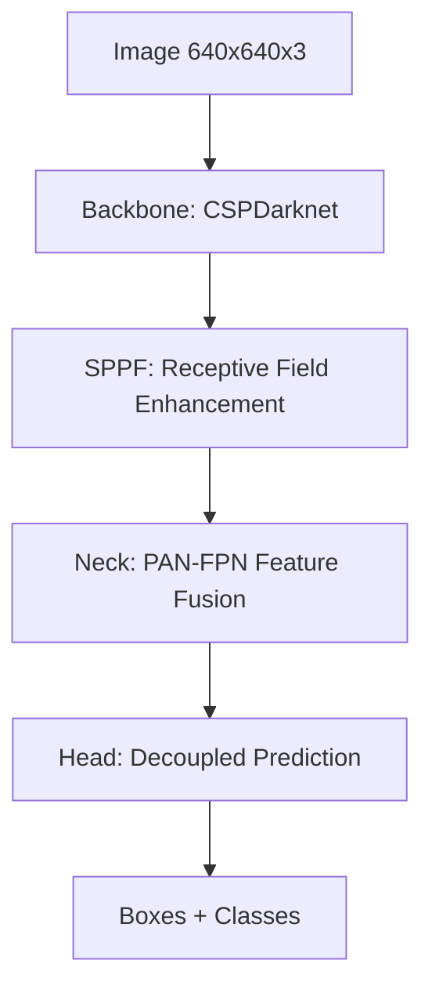

# YOLO CNN Architecture: A Deep Dive

YOLO (You Only Look Once) architectures are famous for being "one-stage" detectors. Unlike two-stage detectors (like Faster R-CNN) that first propose regions and then classify them, YOLO predicts bounding boxes and class probabilities directly from full images in a single pass.

The "CNN" in YOLO is not just one network, but a sophisticated pipeline of three main parts: **Backbone**, **Neck**, and **Head**.

---

## 🏗 The Three-Part Structure

### 1. The Backbone (Feature Extraction)
The backbone is responsible for extracting features from the input image at various scales.
- **Goal**: Transform pixels into meaningful feature maps (edges → textures → parts → objects).
- **Architecture**: Modern YOLO versions (v8-v11) typically use a modified **CSPDarknet** (Cross Stage Partial Darknet).
- **Key Component: CSP (Cross Stage Partial)**:
  - Splitting the feature map into two parts.
  - One part goes through a series of convolutional blocks.
  - The other part skips them and is concatenated at the end.
  - **Why?** It Reduces computational cost while maintaining (or improving) accuracy by reducing redundant gradient information.

### 2. The Neck (Feature Fusion)
The neck sits between the backbone and the head. It combines features from different layers of the backbone.
- **Goal**: Infuse high-level semantic info with low-level spatial info. This is critical for detecting objects of various sizes (especially small ones).
- **Architecture**: Uses **PAN-FPN** (Path Aggregation Network + Feature Pyramid Network).
- **Key Component: SPPF (Spatial Pyramid Pooling - Fast)**:
  - Usually at the end of the backbone.
  - Pools features at different scales (5x5, 9x9, 13x13) to increase the receptive field.
  - **Why?** Helps the model understand the "context" around an object.

### 3. The Head (Prediction)
The head is the final part that actually outputs the detections.
- **Goal**: Predict the Bounding Box (x, y, w, h), Objectness score, and Class probabilities.
- **Evolution**: 
  - **YOLOv5/v7**: Used "Anchor-based" heads (pre-defined box shapes).
  - **YOLOv8/v11**: Switched to **Anchor-free** heads. It treats each pixel as a potential center of an object, predicting distances to the edges.
  - **Decoupled Head**: Modern YOLO heads split the classification and localization (bounding box) tasks into separate branches.

---

## 🔬 Core Convolutional Concepts in YOLO

### 1. Standard Convolution (Conv)
The basic building block. 
- Performs element-wise multiplication with a kernel and sums them up.
- In YOLO, this usually includes **Batch Normalization (BN)** and a **SiLU (Sigmoid-weighted Linear Unit)** activation function.

### 2. C2f / C3 Blocks
These are the most common blocks in the latest YOLO versions.
- They are "CSP" blocks that contain multiple bottleneck layers.
- They balance depth (number of layers) and width (number of channels) to optimize for speed.

### 3. Depthwise Separable Convolutions (Optional)
Used in "Nano" versions of YOLO to significantly reduce parameters and MACs (local compute operations).
- Splits a standard convolution into a **Depthwise** conv (spatial) and a **Pointwise** 1x1 conv (channel-wise).

---

## 🔄 The YOLO Inference Flow

1. **Image is resized** (usually to 640x640).
2. **Backbone extracts features** at scales ×8, ×16, and ×32.
3. **Neck fuses these features** so the ×8 scale (high res) has info from the ×32 scale (high semantic).
4. **Head predicts** on three different scales to catch small, medium, and large objects.
5. **NMS (Non-Maximum Suppression)** filters out overlapping boxes to give the final result.

---

## 🚀 Why is it so fast?

- **Single Pass**: No region proposals.
- **Efficient Kernels**: Optimized 3x3 and 1x1 convolutions.
- **Hardware Optimized**: Designed to run efficiently on both GPUs (using TensorRT) and CPUs (using OpenVINO/NCNN).
- **Global Context**: Because it sees the whole image at once, it makes fewer background errors than traditional "sliding window" or "region proposal" methods.

---

## 🔗 How this relates to your research
You've been looking at **RF-DETR**. While YOLO uses these CNN structures, RF-DETR replaces the **Neck and Head** with **Transformer Encoders/Decoders**. 

- **YOLO** relies on the spatial locality of convolutions.
- **RF-DETR** (and Transformers) relies on global "attention" between all pixels.
